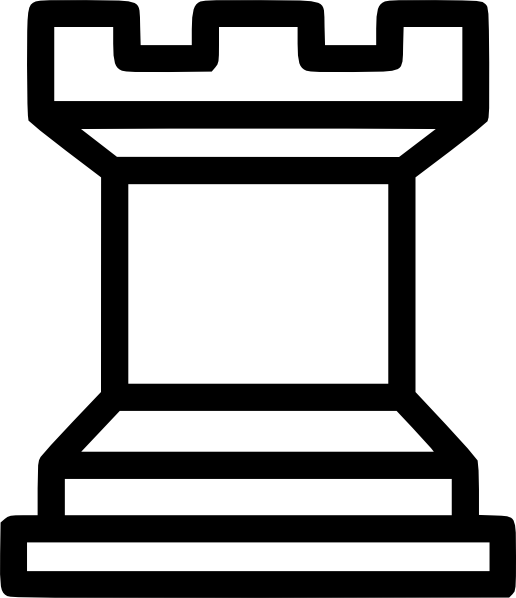
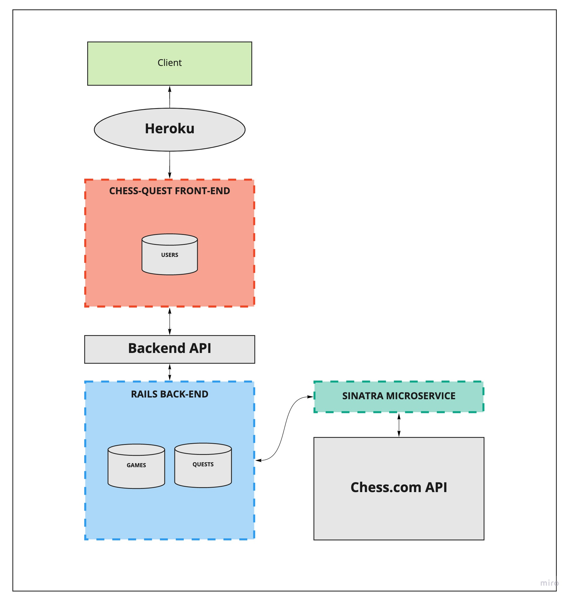

<!-- PROJECT SHIELDS -->
[![Contributors][contributors-shield]][contributors-url]
[![Forks][forks-shield]][forks-url]
[![Stargazers][stars-shield]][stars-url]
[![Issues][issues-shield]][issues-url]

<!-- PROJECT LOGO -->
 

  

  <h3 align="center">CHESS QUEST</h3>

  

    Thunderdome meets Hearthstone Arena meets Chess...it's CHESS QUEST! Online chess, except you play your next game with just the pieces you last won with. How far will your quest take you?
     
     
    <!-- <a href="https://github.com/othneildrew/Best-README-Template">View Demo</a> -->
    <!-- · -->
    <a href="https://github.com/chessquest/chessquest-web/issues">Report Bug</a>
    ·
    <a href="https://github.com/chessquest/chessquest-web/issues">Request Feature</a>
  

<!-- TABLE OF CONTENTS -->

  
Table of Contents

  <ol>
    <li>
      <a href="#about-the-project">About The Project</a>
      <ul>
        <li><a href="#built-with">Built With</a></li>
      </ul>
    </li>
    <li>
      <a href="#getting-started">Getting Started</a>
      <ul>
        <li><a href="#prerequisites">Prerequisites</a></li>
        <li><a href="#installation">Installation</a></li>
      </ul>
    </li>
    <li><a href="#usage">Usage</a></li>
    <li><a href="#roadmap">Roadmap</a></li>
    <li><a href="#contributing">Contributing</a></li>
    <li><a href="#license">License</a></li>
    <li><a href="#contact">Contact</a></li>
    <li><a href="#acknowledgements">Acknowledgements</a></li>
  </ol>

<!-- ABOUT THE PROJECT -->
## About The Project

<!-- [![Product Name Screen Shot][product-screenshot]](https://example.com) -->

Welcome to Chess Quest! This repository contains our backend Rails app. Uppon recieving a request fron our [frontend Rails API](https://github.com/chessquest/chess-quest-web), this app makes calls to the [Sinatra microservice](https://github.com/chessquest/chess-api) to retrieve data from the Chess.com API.

This project is deployed on [Heroku here](https://chess-quest.herokuapp.com)

### Built With

* [Ruby on Rails](https://rubyonrails.org/)
* [Sinatra](http://sinatrarb.com/)
* [PostgreSQL](https://www.postgresql.org/)
* [Bootstrap](https://getbootstrap.com/)
* [JQuery](https://jquery.com/)
* [RSpec](https://github.com/rspec/rspec-rails)
* [Travis CI](https://travis-ci.com/)
* [JavaScript](https://www.javascript.com)
* [OAuth](https://oauth.net/) - *Google OAuth was chosen for the Chess Quest MVP as a means to keep the barriers to entry low (google is quite common)*

<!-- SYSTEM DESIGN -->
## System Design

<!-- GETTING STARTED -->
## Getting Started

###### Versions

- Ruby 2.5.3

- Rails 5.2.4.3

### Installation

1. Fork repository
2. Run `bundle install`
3. Set up the databases `rails db:{create,migrate}` 

<!-- USAGE EXAMPLES -->
## Usage

Contributions are what make the open source community such an amazing place to be learn, inspire, and create. Any contributions you make are **greatly appreciated**. We hope that users provide input to improve their experience and that of others.

###### Making a Contribution
1. Create your Feature Branch (`git checkout -b feature/AmazingFeature`)
2. Commit your Changes (`git commit -m 'Add some AmazingFeature'`)
3. Push to the Branch (`git push origin feature/AmazingFeature`)
4. Open a Pull Request

The Chess.js and Chessboard.js documentation can be referenced for additional [chessboard methods](https://github.com/jhlywa/chess.js/) and [examples of implementation](https://chessboardjs.com/docs), respectively

<!-- ROADMAP -->
## Roadmap

See the [open issues](https://github.com/chessquest/chess-quest-web/issues) for a list of proposed features (and known issues).

<!-- CONTACT -->
## Contact

Adam Etzion [GitHub](https://github.com/aetzion1) [LinkedIn](https://www.linkedin.com/in/adametzion/)
Ely Hess [GitHub](https://github.com/elyhess) [LinkedIn](https://www.linkedin.com/in/ely-hess/)
Grayson Myers [GitHub](https://github.com/graymyers) [LinkedIn](https://www.linkedin.com/in/grayson-myers-285926165/)
Liam Cusack [GitHub](https://github.com/liamcusack) [LinkedIn](https://www.linkedin.com/in/liam-cusack-6a9a0a169/)
Max Ribbans [GitHub](https://github.com/ribbansmax) [LinkedIn](https://www.linkedin.com/in/max-ribbans-46b276156/)
Mike Foy [GitHub](https://github.com/foymikek) [LinkedIn](https://www.linkedin.com/in/michael-foy-707ba7b4/)
Phil McCarthy [GitHub](https://github.com/philmccarthy) [LinkedIn](https://www.linkedin/in/pjmcc)

<!-- ACKNOWLEDGEMENTS -->
## Acknowledgements
* [chessboard.js](https://chessboardjs.com/)
* [chess.js](https://github.com/jhlywa/chess.js)
* [Img Shields](https://shields.io)
* [MIT Open Source License](https://opensource.org/licenses/MIT)

<!-- MARKDOWN LINKS & IMAGES -->
<!-- https://www.markdownguide.org/basic-syntax/#reference-style-links -->
[contributors-shield]: https://img.shields.io/github/contributors/chessquest/chess-quest.svg?style=for-the-badge
[contributors-url]: https://github.com/chessquest/chess-quest/graphs/contributors
[forks-shield]: https://img.shields.io/github/forks/chessquest/chess-quest.svg?style=for-the-badge
[forks-url]: https://github.com/chessquest/chess-quest/network/members
[stars-shield]: https://img.shields.io/github/stars/chessquest/chess-quest.svg?style=for-the-badge
[stars-url]: https://github.com/chessquest/chess-quest/stargazers
[issues-shield]: https://img.shields.io/github/issues/chessquest/chess-quest.svg?style=for-the-badge
[issues-url]: https://github.com/chessquest/chess-quest/issues
<!-- [product-screenshot]: images/screenshot.png -->
